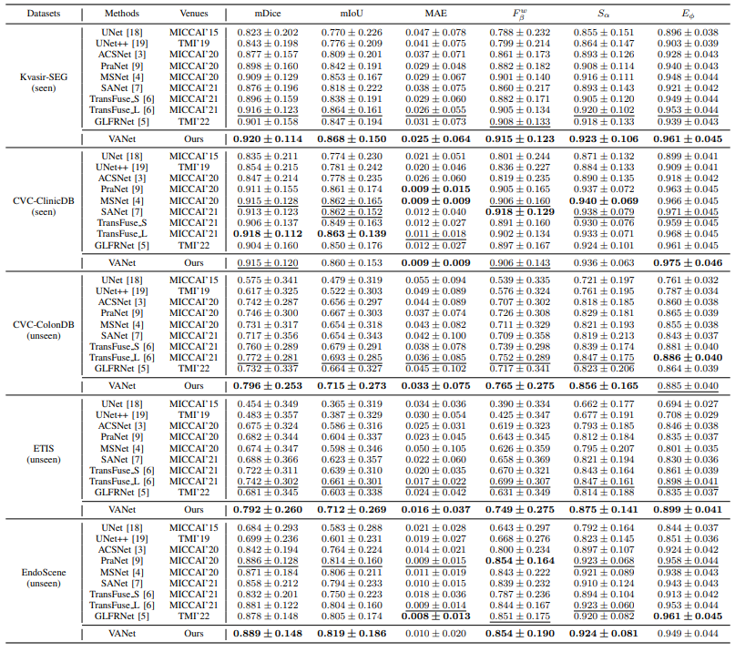

# Know Your Orientation: A Viewpoint-Aware Framework for Polyp Segmentation
The official implementation of [PPFormer](https://link.springer.com/chapter/10.1007/978-3-031-16440-8_60) (MICCAI 2022) and VANet (Pending).  
## 1. Introduction
### 1.1 Background
Automatic polyp segmentation is a challenging task due to two reasons:  
(i) The viewpoint variations presented in colonoscopy images, leading to diverse visual appearance of polyps (as shown in Figure 1).  
(ii) The camouflage property of polyps poses difficulties in polyp boundary determination.  
<p align="center">
     <br />
    <em> 
    Figure 1. Illustration of various viewpoints in colonoscopy images caused by different orientations of the colonoscope tip.
    </em>
</p>

To overcome these issues, we present a novel framework, named viewpoint-aware network (VANet), that improves polyp segmentation performance by effectively using the viewpoint variations in colonoscopy images. Our motivation stems from the observation that during a colonoscopy, clinicians steer the colonoscope according to the position of the central lumen; when possible lesions are encountered, they **reorient** the colonoscope for detailed information. Therefore, we argue that the **central lumen** and **polyps** are two key characteristics for distinguishing viewpoints in colonoscopy images. Thus, a viewpoint classifier ([ResNet](https://openaccess.thecvf.com/content_cvpr_2016/html/He_Deep_Residual_Learning_CVPR_2016_paper.html) used here) can accurately capture the polyps via [Grad-CAM++](https://ieeexplore.ieee.org/abstract/document/8354201).

### 1.2. Framework
The overview of our work is shown in Figure 3. Given an input image, VANet first employs the cue collector to capture potential polyp locations. The location cue is then fed into the VAFormer layers of the encoder to improve attention calculation. VANet's encoder comprises three encoder blocks, where each block is formed by alternating VAFormer and Transformer layers. In the decoding stage, VANet generates prediction maps at different levels and uses them to guide self-attention in BAFormer layers for refinement. We use Convolution Vision Transformer ([CvT](https://openaccess.thecvf.com/content/ICCV2021/html/Wu_CvT_Introducing_Convolutions_to_Vision_Transformers_ICCV_2021_paper.html) as a backbone to construct the encoder-decoder, which integrates convolution operations in Vision Transformer, enabling our model to extract both global and local features. In addition, the removal of position encoding in CvT supports VANet with flexible inputs.
<p align="center">
     <br />
    <em> 
    Figure 2. Overview of VANet.
    </em>
</p>

### 1.3 Performance
VANet achieves the state-of-the-art performance on five polyp segmentation datasets ([benchmark](https://github.com/DengPingFan/PraNet/blob/master)), especially on the unseen datasets. Additionally, VANet is capable of calibrating misaligned predictions and precisely determining polyp boundary.
<p align="center">
     <br />
    <em> 
    Figure 3. Qualitative comparison of the state-of-the-art polyp segmentation algorithms.
    </em>
</p>

<p align="center">
     <br />
    <em> 
    Table 1. Quantative comparison of the state-of-the-art polyp segmentation algorithms.
    </em>
</p>

## 2. Quick Start
### 2.1 Installation
VANet is extended from [CvT](https://github.com/microsoft/CvT).Assuming that you have installed PyTorch and TorchVision, if not, please follow the [officiall instruction](https://pytorch.org/) to install them firstly. 
Intall the dependencies using cmd:
``` sh
python -m pip install -r requirements.txt --user -q
```
The code is developed and tested using pytorch 1.8.0. Other versions of pytorch are not fully tested.
### 2.2 Data preparation
Data are saved at Datasets. We divide the colonoscopy into two classes, namely, parallel and vertical. The VANet_Dataset can be found at [Google-Drive](https://drive.google.com/drive/u/0/folders/1kbYzj9rj_DLwmqqJziIs4sh_KHYbBo6q). Please prepare the data as following:

``` sh
|-Datasets
  |-VANet_Dataset
    |-TrainDataset
    | |-Parallel
    | | |-img1.png
    | | |-img2.png
    | | |-...
    | |-Vertical
    | | |-img3.png
    | | |-...
    | |-mask
    | | |-img1.png
    | | |-...
    | |-...
    |-TestDataset
      |-CVC-300
      | |-img5.jpg
      | |-...
      |-CVC-ColonDB
      | |-img6.jpg
      | |-...
      |-ETIS-LaribPolypDB
      | |-img7.jpg
      | |-...
      |-...
```

### 2.3 Pretrained Weights
Pretrained weights are saved at "./weights/", including CvT-13 model and Resnet (for viewpoint classification). The trained weights can be found at [Google-Drive](https://drive.google.com/drive/u/0/folders/1VZcObrNuZS09GWZmOpJIyqp9lBOPV661). Please prepare the weights as following:

``` sh
|-weights
  |-ResNet-18-352x352.pth
  |-ResNet-50-352x352.pth
  |-CvT-13-384x384-IN-22k.pth
  |-CvT-13-384x384-IN-1k.pth
  |-...
```
Surely, you can also train the viewpoint classification model yourself.

### 2.4 Training
Training your viewpoint classifier:
``` sh
python trainer_cls.py
```

Training your VANet:
``` sh
python trainer_VANet.py
```

### 2.5 Testing
Testing your trained model:
``` sh
python tester_VANet.py
```
For a comprehensive evaluation, you can refer to the toolbox provided by [PraNet](https://github.com/DengPingFan/PraNet/blob/master).

Visualize your viewpoint classifier:
``` sh
python attention_map.py
```

The visual results can directly capture the polyp locations, which is encouraging.
<p align="center">
     <br />
    <em> 
    Figure 4. Visualization of attention maps in viewpoint classification via Grad-CAM++. (a) is the input image, where the polyp is represented by a closed red curve. (b) and (c) represent the attention maps generated from the classifier's parallel and vertical channels, respectively.
    </em>
</p>

## 3. Citation (will be updated soon)
If you find this work or code is helpful in your research, please cite:

```
@inproceedings{cai2022using,
  title={Using Guided Self-Attention with Local Information for Polyp Segmentation},
  author={Cai, Linghan and Wu, Meijing and Chen, Lijiang and Bai, Wenpei and Yang, Min and Lyu, Shuchang and Zhao, Qi},
  booktitle={Medical Image Computing and Computer Assisted Intervention--MICCAI 2022: 25th International Conference, Singapore, September 18--22, 2022, Proceedings, Part IV},
  pages={629--638},
  year={2022},
  organization={Springer}
}
```

## 4. Contributing
Thanks to the following work for improving our project：
- CvT: [https://github.com/microsoft/CvT/tree/main](https://github.com/microsoft/CvT/tree/main)
- torch-cam: [https://github.com/frgfm/torch-cam](https://github.com/frgfm/torch-cam)
- PraNet: [https://github.com/DengPingFan/PraNet/blob/master](https://github.com/DengPingFan/PraNet/blob/master)
- albumentations: [https://github.com/albumentations-team/albumentations](albumentations)

## 5. License
Distributed under the Apache 2.0 License. See LICENSE for more information.
